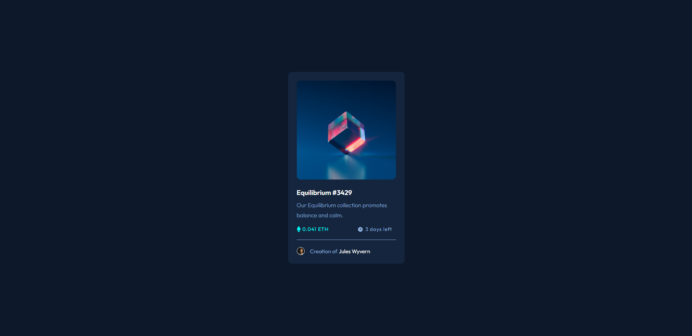

# Frontend Mentor - NFT preview card component solution

This is a solution to the [NFT preview card component challenge on Frontend Mentor](https://www.frontendmentor.io/challenges/nft-preview-card-component-SbdUL_w0U). Frontend Mentor challenges help you improve your coding skills by building realistic projects. 

## Table of contents

- [Overview](#overview)
  - [Screenshot](#screenshot)
  - [Links](#links)
- [My process](#my-process)
  - [Built with](#built-with)
  - [What I learned](#what-i-learned)
- [Author](#author)

## Overview

It has been 1 week since I started learning Frontend development, this is the second challenge and it was super hard for me.

### Screenshot



### Links

- Solution URL: [Click me!](https://your-solution-url.com)
- Live Site URL: [Click me!](https://johnhaab.github.io/QR-code-component/)

## My process

First I started with adding what I need in index.html to get everything working, then I started my styles.css. I had a lot of trouble on this and had to do a lot of research. I was unsure on a lot of things and it took forever, my biggest issue was the hover state on the main image I had to watch a youtube video to get it right and im still tryng to understand the process to it.

### Built with

- HTML5 markup
- CSS custom properties

### What I learned

I leanred how to use opacity that changes on a hover state, I also learned a lot about getting things where they need to be like the icons and the spacing between them along with the bottom border that split the creator and the time/cost.

Code snippets, see below:

```html
<body>

  <div class="card">

    <div class="image">
      
      <div>
        
      </div>
    </div>

        <h3>Equilibrium #3429</h3>

      <div class="desc">
        Our Equilibrium collection promotes balance and calm.
      </div>

      <div class="price-time">
       <div class="price">
        
        0.041 ETH
       </div>
     <div class="time">
      
        3 days left
     </div>
    </div> 

     <div class="creator">
        
         Creation of <span>Jules Wyvern</span>
     </div>
     </div>
</body>
```
```css
.image div{
    position: absolute;
    background-color: hsl(178, 100%, 50% );;
    top: 0;
    width: 100%;
    height: 100%;
    opacity: 0; 
}

.image div img {
    position: absolute;
    top: 50%;
    left: 50%;
    transform: translate(-50%, -50%);
}

.image div:hover {
    opacity: 1;
    cursor: pointer;
    border-radius: 10px;
}
```

## Author

- Frontend Mentor - [@johnhaab](https://www.frontendmentor.io/profile/johnhaab)
- Twitter - [@johnlhaab](https://www.twitter.com/johnlhaab)
